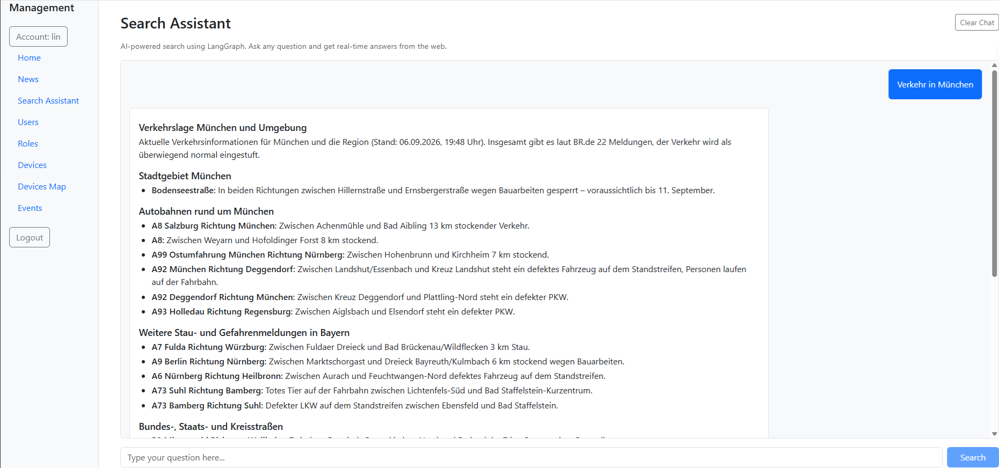
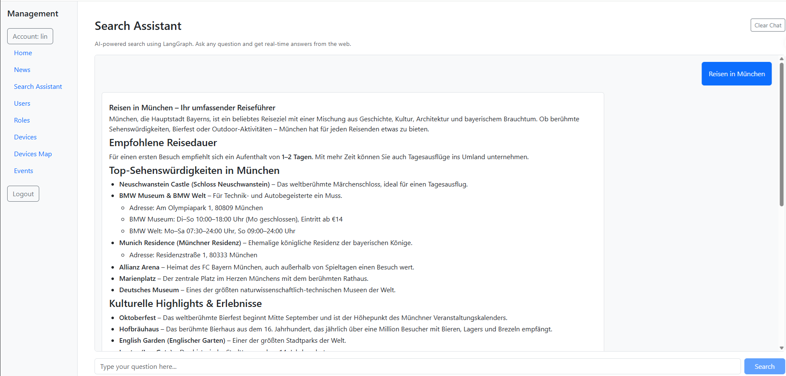

# FastAPI + PostgreSQL + AI

FastAPI REST API with PostgreSQL database using SQLAlchemy ORM, featuring JWT authentication, AI-powered features, and a React frontend.

## Project Structure

```
├── main.py                # App entry point, CORS config, router registration
├── database.py            # DB connection & session factory
├── core/
│   └── security.py        # JWT auth, password hashing, OAuth2 scheme
├── models/
│   ├── user.py            # SQLAlchemy User model
│   ├── device.py          # SQLAlchemy Device model
│   ├── role.py            # SQLAlchemy Role model
│   └── roledevice.py      # Many-to-many relationship table (roles ↔ devices)
├── schemas/
│   ├── user.py            # Pydantic User schemas (Create, Update, Out, Login)
│   ├── device.py          # Pydantic Device schemas (Create, Update, Out)
│   └── role.py            # Pydantic Role schemas (CreateDto, UpdateDto, RoleDto, DeviceDto)
├── crud/
│   ├── user.py            # User CRUD operations
│   ├── device.py          # Device CRUD operations
│   └── role.py            # Role CRUD operations (with device associations)
├── routers/
│   ├── auth.py            # Auth endpoints (login, hash password)
│   ├── user.py            # User API endpoints
│   ├── device.py          # Device API endpoints
│   ├── role.py            # Role API endpoints
│   ├── event.py           # Event API endpoints (REST + WebSocket)
│   ├── ai_summary.py      # AI summary endpoint (OpenRouter integration)
│   ├── langgraph.py       # LangGraph search assistant (Tavily + OpenRouter)
│   ├── traffic.py         # Traffic analysis endpoint (YOLOv8 vehicle detection)
│   └── news.py            # Traffic news endpoint (BR.de traffic data + cache)
├── frontend/              # React + Vite frontend application
│   ├── src/
│   │   ├── pages/         # Login, Home, Users, Devices, DevicesMap, Roles, Events, News, LangGraph pages
│   │   ├── components/    # Sidebar, AISummary components
│   │   ├── axios.js       # Centralized Axios instance with 401 interceptor
│   │   ├── configContext.jsx  # App configuration context
│   │   └── eventsContext.jsx  # Real-time events context (WebSocket + REST)
│   └── package.json
├── api_io_log.py          # Request/response logging middleware
├── logs/                  # Auto-created log directory (YYYY-MM-DD.log files)
├── yolov8n.pt             # YOLOv8 nano model (vehicle detection)
├── service.py             # Test service
└── test.py                # PostgreSQL test
```

## Environment Variables

| Variable | Default | Description |
|----------|---------|-------------|
| `POSTGRES_USER` | postgres | PostgreSQL username |
| `POSTGRES_PASSWORD` | 123456 | PostgreSQL password |
| `POSTGRES_HOST` | localhost | PostgreSQL host |
| `POSTGRES_PORT` | 5432 | PostgreSQL port |
| `POSTGRES_DB` | dzservice | Database name |
| `SECRET_KEY` | - | JWT signing key (required) |
| `OPENROUTER_API_KEY` | - | OpenRouter API key for AI summaries |
| `OPENROUTER_URL` | - | OpenRouter API endpoint URL |
| `OPENROUTER_MODEL` | - | OpenRouter model identifier |
| `TAVILY_API_KEY` | - | Tavily API key for web search (required for LangGraph) |
| `LLM_BASE_URL` | https://openrouter.ai/api/v1 | LLM API base URL for LangGraph |
| `LLM_MODEL_ID` | - | LLM model identifier for LangGraph |

## Run

### Backend

```bash
python main.py
```

Starts the FastAPI server on `http://0.0.0.0:8000` with auto-reload.

### Frontend

```bash
cd frontend
npm install
npm run dev
```

Starts the Vite dev server (default: `http://localhost:5173`).

## CORS

The backend allows all origins (`*`), methods, and headers for development. Restrict `allow_origins` in [main.py](main.py#L10-L16) for production.

## Request/Response Logging

`ApiIOMiddleware` logs method, path, status code, duration, and request/response bodies for every request.

**Skipped by default:** `/docs`, `/redoc`, `/openapi.json`, `/docs/oauth2-redirect`, `/favicon.ico`, and `OPTIONS` requests.

**Logs:** Written to `logs/YYYY-MM-DD.log` (one file per day, auto-created).

**Config options** (in [main.py](main.py#L11)):

| Parameter | Type | Default | Description |
|-----------|------|---------|-------------|
| `skip_paths` | `set[str]` | docs/openapi/favicon paths | Paths to exclude from logging |
| `skip_html` | `bool` | `True` | Skip logging HTML responses (e.g. Swagger UI) |

Binary request/response bodies are logged as `<N bytes binary>` instead of raw content.

## API Docs

http://127.0.0.1:8000/docs

All endpoints (except `/auth/*`) require a valid JWT token in the `Authorization: Bearer <token>` header.

## Endpoints

### Auth

| Method | Endpoint | Description | Auth |
|--------|----------|-------------|------|
| POST | /auth/token | Login and get JWT token (rejects inactive accounts) | No |
| POST | /auth/hashpwd | Hash a password with bcrypt | No |

### Users

| Method | Endpoint | Description |
|--------|----------|-------------|
| GET | /users/ | List all users |
| GET | /users/{user_id} | Get user by ID |
| POST | /users/ | Create user |
| PUT | /users/{user_id} | Update user |
| DELETE | /users/{user_id} | Delete user |

### Devices

| Method | Endpoint | Description |
|--------|----------|-------------|
| GET | /devices/ | List all devices (optional `?user_account=` filter by role) |
| GET | /devices/{device_id} | Get device by ID |
| POST | /devices/ | Create device |
| PUT | /devices/{device_id} | Update device |
| DELETE | /devices/{device_id} | Delete device |

### Roles

| Method | Endpoint | Description |
|--------|----------|-------------|
| GET | /roles/ | List all roles (with associated devices) |
| GET | /roles/{role_id} | Get role by ID |
| POST | /roles/ | Create role with device associations |
| PUT | /roles/{role_id} | Update role and device associations |
| DELETE | /roles/{role_id} | Delete role |

### Events

| Method | Endpoint | Description |
|--------|----------|-------------|
| GET | /events | List current events (one per device) |
| PUT | /events | Add/update an event for a device |
| WS | /events/ws?token=\<jwt\> | WebSocket for real-time event updates |

### AI Summary

| Method | Endpoint | Description | Auth |
|--------|----------|-------------|------|
| POST | /ai/summary | Generate AI summary of device statistics via OpenRouter | Yes |

### LangGraph Search Assistant

| Method | Endpoint | Description | Auth |
|--------|----------|-------------|------|
| POST | /ai/langgraph | Smart search using LangGraph + Tavily API + OpenRouter LLM (BR.de for Bayern traffic) | No |

### Traffic Analysis

| Method | Endpoint | Description | Auth |
|--------|----------|-------------|------|
| POST | /ai/traffic/cars | Detect vehicles in a video stream using YOLOv8 | Yes |

### News

| Method | Endpoint | Description | Auth |
|--------|----------|-------------|------|
| GET | /news | Fetch traffic messages from BR.de (2-min cache) | No |
| GET | /news?force=true | Force refresh, bypass cache | No |

## Models

### User

| Field | Type | Description |
|-------|------|-------------|
| Id | Integer | Primary key |
| Account | String(50) | Unique username |
| Name | String(50) | Display name |
| Email | String(50) | Email address |
| Pwd | String(200) | Password hash |
| IsActive | Boolean | Active status |
| RoleId | BigInteger | Role identifier |
| CreatedDate | DateTime | Creation timestamp |
| UpdatedDate | DateTime | Last update timestamp |

### Device

| Field | Type | Description |
|-------|------|-------------|
| Id | Integer | Primary key |
| Code | String(50) | Unique device code |
| Name | String(50) | Device name |
| DeviceType | String(20) | Device type |
| Params | String(200) | Device parameters |
| Lat | Decimal(9,6) | Latitude |
| Lng | Decimal(9,6) | Longitude |
| IsActive | Boolean | Active status |
| Status | String(20) | Device status |
| CreatedDate | DateTime | Creation timestamp |
| UpdatedDate | DateTime | Last update timestamp |

### Role

| Field | Type | Description |
|-------|------|-------------|
| Id | Integer | Primary key |
| Name | String(50) | Role name |
| Devices | Relationship | Associated devices (many-to-many via `roledevices`) |
| CreatedDate | DateTime | Creation timestamp |
| UpdatedDate | DateTime | Last update timestamp |

### RoleDevice (Association Table)

| Field | Type | Description |
|-------|------|-------------|
| RoleId | BigInteger | Foreign key → `roles.id` (composite PK) |
| DeviceId | BigInteger | Foreign key → `devices.id` (composite PK) |

## Authentication

1. Obtain a JWT token via `POST /auth/token` with `account` and `password`
2. Use the token in the `Authorization: Bearer <token>` header for all protected endpoints
3. Tokens expire after 60 minutes
4. Inactive accounts are rejected at login

### Password Security

Passwords are automatically hashed with bcrypt via `security.get_password_hash()` before being stored to the database. This applies to both user creation and updates.

## Frontend

The [frontend/](frontend/) directory contains a React 19 + Vite 8 application with:

- **React Router 7** — client-side routing
- **Bootstrap 5** — UI components
- **Axios** — HTTP client for API calls
- **Chart.js** — Pie and bar charts for dashboard visualizations
- **Leaflet** — Interactive maps with device markers, tooltips, popups, and live stream modal

### Axios Configuration

The app uses a centralized Axios instance ([frontend/src/axios.js](frontend/src/axios.js)) with a response interceptor that:

- Catches **401 Unauthorized** responses
- Clears stored `token` and `account` from `localStorage`
- Redirects to the login page (`/`)
- Skips the redirect for login requests (`/auth/token`)

### Pages

| Page | Description |
|------|-------------|
| Login | Authentication form, stores JWT token |
| Home | Dashboard with summary cards (users/roles/devices counts), AI summary button, device status pie chart, devices-per-role bar chart, and recent devices table |
| Users | User management (list, create, edit, delete) with role assignment |
| Devices | Device management (list, create, edit, delete) with live stream modal, Google Maps embed modal, and traffic analysis modal (YOLOv8 vehicle detection) |
| DevicesMap | Full-screen Leaflet map showing all devices as camera markers with tooltips, popups, and live stream modal |
| Roles | Role management with inline create/edit form and multi-select device associations |
| Events | Real-time event log showing device status changes, alarms, and info events |
| News | Traffic news map with category filtering, location markers, and per-location map modal |
| Search Assistant | AI-powered search chat using LangGraph, Tavily API, and OpenRouter LLM |

### Device Filtering

The Devices page automatically filters devices by the logged-in user's role via `?user_account=` query parameter. Users only see devices associated with their assigned role.

### Devices Map

The [DevicesMap](frontend/src/pages/DevicesMap.jsx) page displays all devices on a Leaflet map with:

- **Camera markers** — Custom SVG camera icons via `L.DivIcon` (no wrapper class for pixel-accurate positioning)
- **Tooltips** — Hover to see device name, type, and status
- **Popups** — Click for details (name, type, position, status) with a "Live Stream" button
- **Live Stream modal** — Displays the device's video stream from `Params.VideoStream`
- **Auto-fit bounds** — Map zooms to fit all device markers
- **Role-based filtering** — Shows only devices associated with the logged-in user's role
- **Deferred map init** — `invalidateSize()` called after modal transition to fix sizing in modal context
- **Code-split** — DevicesMap page is lazy-loaded via `React.lazy()`, excluded from the initial bundle

### Traffic Analysis



The Devices page includes a **Traffic Analysis** feature that detects vehicles in video streams using YOLOv8:

- **Vehicle detection** — Analyzes video stream frames for cars, trucks, buses, motorcycles, and bicycles
- **Annotated image** — Returns the original image with detection bounding boxes drawn
- **Vehicle count** — Displays total detected vehicles and breakdown by class
- **Modal display** — Results shown in a modal with the annotated image

Backend endpoint: `POST /ai/traffic/cars` with `{ url: "<video_stream_url>" }`.

### AI Summary

The Home page includes an **AI Summary** button that generates a natural language summary of device statistics using OpenRouter:

- **Device statistics** — Summarizes total devices, active/error/offline counts, and recently updated devices
- **OpenRouter integration** — Calls the configured OpenRouter model via `POST /ai/summary`
- **Modal display** — Summary text shown in a modal dialog

Requires `OPENROUTER_API_KEY`, `OPENROUTER_URL`, and `OPENROUTER_MODEL` environment variables.

### LangGraph Search Assistant

A real-world search system powered by LangGraph, Tavily API, and OpenRouter LLM:

- **Query understanding** — Analyzes user queries to generate optimal search keywords
- **Bilingual support** — Search keywords and answers are generated in the same language as the user's query (German or English)
- **Bayern traffic detection** — Automatically uses BR.de data for Bayern/traffic queries (keywords: bayern, münchen, verkehr, stau, autobahn, etc.)
- **Web search** — Uses Tavily API to fetch real-time information from the internet
- **Answer generation** — Synthesizes search results into comprehensive answers using LLM
- **Fallback handling** — Falls back to LLM knowledge if search API is unavailable
- **Stateful workflow** — 3-step pipeline: understand → search → answer

Backend endpoint: `POST /ai/langgraph` with `{ "query": "<user question>" }`.

Requires `TAVILY_API_KEY`, `LLM_BASE_URL`, and `LLM_MODEL_ID` environment variables.

### Configuration

The frontend uses a `configContext` for app-wide settings. See [frontend/src/configContext.jsx](frontend/src/configContext.jsx).

### Events (Real-Time)

The [eventsContext](frontend/src/eventsContext.jsx) provides real-time event updates via WebSocket:

- **Initial load** — Fetches current events via `GET /events` on mount
- **WebSocket** — Connects to `ws://<host>/events/ws?token=<jwt>` for live updates
- **Snapshot** — Full event list pushed on connect (one event per device)
- **Incremental** — Individual event updates pushed as they arrive
- **Unread indicator** — Sidebar shows a red dot when new events arrive; cleared when the Events page is visited
- **Ping/keepalive** — Sends `ping` every 30 seconds to prevent connection timeout

### News (Traffic Messages)

The [News](frontend/src/pages/News.jsx) page displays real-time traffic messages from BR.de with an interactive map:

- **Data source** — Fetches traffic messages from `https://www.br.de/verkehrskarte/verkehrsdaten/verkehrsmeldungen.json`
- **Server-side cache** — 2-minute TTL cache, pre-warmed at startup for instant first load
- **Force refresh** — `GET /news?force=true` bypasses the cache and fetches live data
- **No-cache headers** — `Cache-Control: no-cache, no-store, must-revalidate` prevents browser caching
- **Category filtering** — Filter messages by category (Gefahren, Autobahnen, etc.)
- **Location markers** — Click a headline to open a Leaflet map modal showing the incident location
- **Marker positioning** — Uses `L.DivIcon` with inline SVG wrapped in a sized div (`line-height:0`) for pixel-accurate anchor alignment; no `.leaflet-div-icon` class to avoid border/background offset
- **Lazy map mount** — `MapContainer` only renders when the modal opens, avoiding unnecessary tile downloads on page load
- **Code-split** — News page and Leaflet (154 KB) are lazy-loaded via `React.lazy()`, excluded from the initial bundle

Backend endpoint: `GET /news` (no auth required).

### Search Assistant (LangGraph)



The [Search Assistant](frontend/src/pages/LangGraph.jsx) page provides an AI-powered chat interface for real-time web searches:

- **Chat interface** — Type questions in a chat-style UI with message history
- **LangGraph workflow** — 3-step pipeline: query understanding → web search → answer generation
- **Bilingual support** — Search keywords and answers match the query's language (German or English)
- **Bayern traffic detection** — Automatically uses BR.de data for Bayern/traffic queries (keywords: bayern, münchen, verkehr, stau, autobahn, etc.)
- **Tavily API** — Fetches real-time information from the internet
- **OpenRouter LLM** — Generates comprehensive answers using search results
- **Fallback handling** — Falls back to LLM knowledge if search API is unavailable
- **Keyboard shortcut** — Press Enter to submit, Shift+Enter for new line
- **Code-split** — Page is lazy-loaded via `React.lazy()`, excluded from the initial bundle

Backend endpoint: `POST /ai/langgraph` with `{ "query": "<user question>" }`.

### Page Layout

Users, Roles, and Devices pages use `container-fluid` for full-width content area. Other pages (Home, Events, News) also use `container-fluid`.
