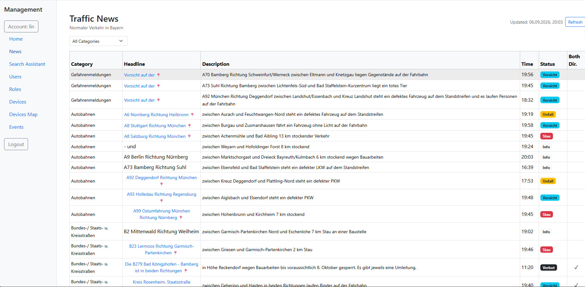

# FastAPI + PostgreSQL + AI

[](https://bitbucket.org/linchen91/fastapi-postgres-ai/pipelines)

FastAPI REST API with PostgreSQL database using async SQLAlchemy (asyncpg), featuring JWT authentication, AI-powered features, and a React frontend.

## Project Structure

```
├── main.py                # App entry point, CORS config, router registration
├── database.py            # Async DB engine & session factory (asyncpg)
├── llmbase.py             # Shared LLM (OpenRouter) and Tavily client singletons
├── api_io_log.py          # Request/response logging middleware
├── core/
│   └── security.py        # JWT auth, password hashing, OAuth2 scheme, async current-user dependency
├── models/
│   ├── user.py            # SQLAlchemy User model
│   ├── device.py          # SQLAlchemy Device model
│   ├── role.py            # SQLAlchemy Role model
│   └── roledevice.py      # Many-to-many relationship table (roles ↔ devices)
├── schemas/
│   ├── user.py            # Pydantic User schemas (Create, Update, Out, Login)
│   ├── device.py          # Pydantic Device schemas (Create, Update, Out)
│   └── role.py            # Pydantic Role schemas (CreateDto, UpdateDto, RoleDto, DeviceDto)
├── crud/
│   ├── user.py            # User CRUD operations (async)
│   ├── device.py          # Device CRUD operations (async)
│   └── role.py            # Role CRUD operations with device associations (async)
├── routers/
│   ├── auth.py            # Auth endpoints (login, hash password)
│   ├── user.py            # User API endpoints
│   ├── device.py          # Device API endpoints
│   ├── role.py            # Role API endpoints
│   ├── event.py           # Event API endpoints (REST + WebSocket)
│   ├── ai_summary.py      # AI summary endpoint (OpenRouter integration)
│   ├── ai_search.py       # LangGraph search assistant (Tavily + OpenRouter)
│   ├── traffic.py         # Traffic analysis endpoint (YOLOv8 vehicle detection)
│   └── news.py            # Traffic news endpoint (BR.de traffic data + cache)
├── frontend/              # React + Vite frontend application
│   ├── src/
│   │   ├── pages/         # Login, Home, Users, Devices, DevicesMap, Roles, Events, News, AISearch pages
│   │   ├── components/    # Sidebar, AISummary components
│   │   ├── axios.js       # Centralized Axios instance with 401 interceptor
│   │   ├── configContext.jsx  # App configuration context
│   │   └── eventsContext.jsx  # Real-time events context (WebSocket + REST)
│   ├── tests/             # Playwright e2e tests (offline, API mocked)
│   ├── playwright.config.js  # Playwright config (auto-starts Vite via webServer)
│   └── package.json
├── k8s/                   # Kubernetes deployment manifests
│   ├── namespace.yml      # Namespace: fastapi-postgres
│   ├── configmap.yml      # Non-sensitive config (POSTGRES_HOST/PORT/DB, OPENROUTER_URL)
│   ├── secret.yml         # Sensitive config (POSTGRES credentials, SECRET_KEY, API keys)
│   ├── postgres-deployment.yml  # PostgreSQL 16-alpine deployment (PVC storage, probes)
│   ├── postgres-service.yml     # ClusterIP service for PostgreSQL
│   ├── api-deployment.yml       # API deployment with env from ConfigMap/Secret, health probes
│   └── api-service.yml          # NodePort service for API
├── terraform/             # Terraform config (Kubernetes provider, mirrors k8s/)
│   ├── versions.tf        # Terraform + provider version constraints
│   ├── providers.tf       # Kubernetes provider (kubeconfig via config_path)
│   ├── variables.tf       # All tunables (namespace, DB, secrets, images, ports)
│   ├── namespace.tf       # Namespace resource
│   ├── config.tf          # ConfigMap + Secret
│   ├── postgres.tf        # PostgreSQL Deployment + ClusterIP Service
│   ├── api.tf             # API Deployment + NodePort Service
│   ├── outputs.tf         # namespace / service names / node port
│   ├── terraform.tfvars.example  # Placeholder values (copy to terraform.tfvars)
│   └── tests/plan.tftest.hcl     # Offline plan assertions (terraform test)
├── ansible/               # Ansible deployment (Docker host + compose stack)
│   ├── ansible.cfg        # Inventory/roles defaults (run playbooks from ansible/)
│   ├── .ansible-lint      # Lint profile for CI
│   ├── inventory/
│   │   ├── hosts.yml      # Deploy targets (group: app) + local test group
│   │   └── group_vars/all.yml  # Non-secret tunables (app_root, app_repo, api_port)
│   ├── vars/vault.yml.example  # Secret placeholders (copy to vault.yml, gitignored)
│   ├── playbooks/deploy.yml    # Install Docker, clone repo, compose up, health check
│   ├── playbooks/test_config.yml  # Offline contract assertions (ansible test)
│   └── roles/
│       ├── docker/        # Docker engine + compose plugin install
│       └── app/           # Git deploy, .env + override templates, compose up
├── scripts/
│   ├── test-terraform.sh  # fmt + validate + test entrypoint (local & CI)
│   └── test-ansible.sh    # lint + syntax-check + offline assertions (local & CI)
├── tests/                 # pytest unit tests (offline)
│   ├── conftest.py        # sys.path bootstrap for test imports
│   ├── test_ai_summary.py # OpenRouter retry/backoff + error detail tests
│   └── test_database_pool.py  # connection pool config tests
├── bitbucket-pipelines.yml # Bitbucket Pipelines CI (terraform, ansible & Playwright e2e tests)
├── logs/                  # Auto-created log directory (YYYY-MM-DD.log files)
├── static/                # Built frontend (auto-created by Docker or manual build)
├── yolov8n.pt             # YOLOv8 nano model (vehicle detection)
├── Dockerfile             # Multi-stage build (frontend + backend)
├── docker-compose.yml     # Docker Compose config (PostgreSQL + API)
├── requirements.txt       # Python dependencies
├── requirements-dev.txt   # Test dependencies (pytest)
├── .dockerignore          # Docker build exclusions
├── .gitignore             # Git ignore rules
├── service.py             # Test service
└── test.py                # PostgreSQL + vector search test (LangChain + LlamaIndex with OpenRouter)
```

## Environment Variables

| Variable | Default | Description |
|----------|---------|-------------|
| `POSTGRES_USER` | postgres | PostgreSQL username |
| `POSTGRES_PASSWORD` | 123456 | PostgreSQL password |
| `POSTGRES_HOST` | localhost | PostgreSQL host |
| `POSTGRES_PORT` | 5432 | PostgreSQL port |
| `POSTGRES_DB` | dzservice | Database name |
| `DB_POOL_SIZE` | 10 | SQLAlchemy connection pool size per worker |
| `DB_MAX_OVERFLOW` | 20 | Extra connections allowed beyond `DB_POOL_SIZE` |
| `DB_POOL_TIMEOUT` | 30 | Seconds to wait for a pooled connection |
| `DB_POOL_RECYCLE` | 1800 | Seconds before a pooled connection is recycled |
| `DB_ECHO` | true | Log SQL statements (set `false` in production) |
| `SECRET_KEY` | - | JWT signing key (required) |
| `OPENROUTER_API_KEY` | - | OpenRouter API key for AI summaries |
| `OPENROUTER_MODEL` | - | OpenRouter model identifier, identifier for LangGraph |
| `TAVILY_API_KEY` | - | Tavily API key for web search (required for LangGraph) |
| `OPENROUTER_URL` | https://openrouter.ai/api/v1 | LLM API base URL for LangGraph |

## Run

### Backend

```bash
python main.py
```

Starts the FastAPI server on `http://0.0.0.0:8001` with auto-reload.

### Frontend

```bash
cd frontend
npm install
npm run dev
```

Starts the Vite dev server on `http://127.0.0.1:5173` (bound to IPv4 explicitly — see [frontend/vite.config.js](frontend/vite.config.js)).

### Docker

Build and run with Docker Compose (includes PostgreSQL + API):

```bash
docker compose up --build
```

This starts:
- **db** — PostgreSQL 16 on port `5432`
- **api** — FastAPI app on port `8001` (serves built frontend from `static/`)

To run in background:

```bash
docker compose up -d --build
```

To stop and remove volumes:

```bash
docker compose down -v
```

**Environment variables** can be set in a `.env` file or exported before running:

```bash
export OPENROUTER_API_KEY=your-key
export TAVILY_API_KEY=your-key
docker compose up --build
```

### Kubernetes

Deploy to a Kubernetes cluster using the manifests in `k8s/`:

```bash
# Create namespace and apply all resources
kubectl apply -f k8s/namespace.yml
kubectl apply -f k8s/configmap.yml
kubectl apply -f k8s/secret.yml
kubectl apply -f k8s/postgres-deployment.yml
kubectl apply -f k8s/postgres-service.yml
kubectl apply -f k8s/api-deployment.yml
kubectl apply -f k8s/api-service.yml
```

Or apply everything at once:

```bash
kubectl apply -f k8s/
```

**Resources created:**
- **Namespace** — `fastapi-postgres`
- **ConfigMap** (`app-config`) — non-sensitive settings (DB host/port/name, LLM base URL)
- **Secret** (`app-secrets`) — sensitive values (DB credentials, `SECRET_KEY`, API keys)
- **PostgreSQL** — `postgres:16-alpine` with a `PersistentVolumeClaim` (`postgres-data`, 1Gi) so data survives pod recreation, liveness/readiness probes via `pg_isready`
- **API** — `fastapi-postgres-ai:latest` (`imagePullPolicy: Never`, expects locally built image), liveness/readiness probes on `/docs`

**API service** type is `NodePort` — access via `<node-ip>:<node-port>`. PostgreSQL uses `ClusterIP` (internal only).

> **Note:** The API image must be built and available to the cluster before deploying. Since `imagePullPolicy: Never`, load the image into your cluster's container runtime first (e.g. `minikube image load fastapi-postgres-ai:latest`).

Edit `k8s/secret.yml` before deploying — replace placeholder values with real credentials.

#### Database auto-init & login guarantee

On every startup the API, in the [main.py](main.py) lifespan:

1. Creates any missing tables via `Base.metadata.create_all()` (idempotent — never alters existing tables; matches [models/](models/))
2. Seeds an `admin` user if no such account exists (**password: `admin123`** — change `ADMIN_PWD_HASH` in `main.py` before real deployments)

Postgres stores its data on a PVC (`postgres-data`), so the database survives pod recreation. As a second layer, if the database is ever wiped or recreated empty, login is **self-healing**: restart the API and schema + admin user are re-created automatically — no manual `psql` steps. Verified end-to-end: emptied database → API restart → `POST /auth/token` returns `200` + JWT with correct credentials, `400` with wrong ones.

> **Important:** env vars sourced from `secretKeyRef` are only read at pod creation. After changing `k8s/secret.yml`, restart the API so it picks up the new values:
> ```bash
> kubectl apply -f k8s/secret.yml
> kubectl rollout restart deploy/api -n fastapi-postgres
> ```
> Otherwise the API keeps the old `POSTGRES_PASSWORD` and login fails with `password authentication failed`.

**Progress log (2026-09-23):** "k8s login failed" diagnosed and fixed. Root cause 1: empty database (no tables) → HTTP 500 on `POST /auth/token` (`relation "users" does not exist`) → frontend "Login failed, try again later". Fixed by `create_all` + admin seed in the app lifespan (`k8s/db-init.yml` was introduced as a DB-side alternative, then rolled back as redundant). Root cause 2: API pod held a stale `POSTGRES_PASSWORD` from before the secret was updated → `password authentication failed` after Postgres re-init. Fixed with `kubectl rollout restart deploy/api`. Root cause 3: `emptyDir` storage wiped the DB whenever the Postgres pod was recreated while the API pod kept running → AI Summary and login failed with `relation "users" does not exist`. Fixed by migrating Postgres to a PVC (`postgres-data`). Verified: login `200`, AI Summary `200`, data survives Postgres pod restarts.

### Terraform Deployment

[terraform/](terraform/) manages the same resources as the raw YAML in `k8s/`, using the Kubernetes provider. The raw manifests remain available as an alternative.

```bash
cp terraform/terraform.tfvars.example terraform/terraform.tfvars
# edit terraform/terraform.tfvars — set real secrets (gitignored)

terraform -chdir=terraform init
terraform -chdir=terraform plan
terraform -chdir=terraform apply
```

**Prerequisites:** a reachable Kubernetes cluster and a valid kubeconfig (`config_path`, default `~/.kube/config`). Build/load the API image first (`minikube image load fastapi-postgres-ai:latest`) — `api_image_pull_policy` defaults to `Never`, matching `k8s/`.

Key variables (see [terraform/variables.tf](terraform/variables.tf)): `namespace`, `postgres_*`, `secret_key`, `openrouter_api_key`, `openrouter_model`, `tavily_api_key`, `api_image`, `api_node_port`. State is local (`terraform/terraform.tfstate`, gitignored).

### Terraform Tests

```bash
./scripts/test-terraform.sh
```

Runs `terraform fmt -check`, `init -backend=false`, `validate`, and native `terraform test` plan assertions ([terraform/tests/plan.tftest.hcl](terraform/tests/plan.tftest.hcl)). Tests are fully offline — a dummy kubeconfig is generated automatically; **no cluster, credentials, or real secrets are required**.

**CI:** [bitbucket-pipelines.yml](bitbucket-pipelines.yml) runs the same script in `hashicorp/terraform:1.9.5` on every push to this repository (Bitbucket workspace `linchen91`). Locally and in CI the entrypoint is identical: `./scripts/test-terraform.sh`.

Repository remotes:

| Remote | URL |
|--------|-----|
| `origin` | `https://github.com/linchen91/fastapi-postgres-ai.git` |
| `bitbucket` | `https://bitbucket.org/linchen91/fastapi-postgres-ai.git` (triggers Pipelines on push) |

### Ansible Deployment

[ansible/](ansible/) provisions a Linux host over SSH: installs Docker, clones this repository, writes runtime config from vault variables, and brings up the Docker Compose stack (the same stack as `docker compose up --build`).

**Prerequisites:** a reachable Linux host (Debian/Ubuntu or RHEL family) with SSH access, and `ansible-core` on the control machine (`pip install ansible-core`).

```bash
cp ansible/vars/vault.yml.example ansible/vars/vault.yml
# edit ansible/vars/vault.yml — set real secrets (gitignored)
# edit ansible/inventory/hosts.yml — replace 192.0.2.10 with your host IP

cd ansible
ansible-playbook playbooks/deploy.yml
```

Run from inside `ansible/` so [ansible/ansible.cfg](ansible/ansible.cfg) resolves the inventory and roles path automatically.

**What it does:**

1. Loads `vars/vault.yml.example`, overridden by `vars/vault.yml` when present (same workflow as `terraform.tfvars`)
2. **docker role** — installs `docker.io` + `docker-compose-v2` (Debian family) or `docker` + `docker-compose-plugin` (RedHat family), enables the service, creates `app_user`, and adds it to the `docker` group
3. **app role** — clones the repo to `app_root`, templates `.env` (OpenRouter/Tavily keys interpolated by docker-compose) and `docker-compose.override.yml` (replaces the base file's hardcoded `SECRET_KEY` and DB password), runs `docker compose up -d --build`, then waits for `http://localhost:8001/docs`

**Key variables** (defaults in [ansible/inventory/group_vars/all.yml](ansible/inventory/group_vars/all.yml), secrets in [ansible/vars/vault.yml.example](ansible/vars/vault.yml.example)):

| Variable | Default | Description |
|----------|---------|-------------|
| `app_name` | fastapi-postgres-ai | Application name |
| `app_root` | /opt/fastapi-postgres-ai | Deployment directory on the target host |
| `app_repo` | bitbucket URL | Git repository to clone |
| `app_version` | main | Git ref to deploy |
| `app_user` | deploy | System user added to the docker group |
| `api_port` | 8001 | API port used for the health check |
| `secret_key` | (placeholder) | JWT signing key — override in `vault.yml` |
| `postgres_user` | (placeholder) | PostgreSQL username — override in `vault.yml` |
| `postgres_password` | (placeholder) | PostgreSQL password — override in `vault.yml` |
| `postgres_db` | (placeholder) | PostgreSQL database name — override in `vault.yml` |
| `openrouter_api_key` / `openrouter_model` / `openrouter_url` | (placeholder) | OpenRouter LLM settings |
| `tavily_api_key` | (placeholder) | Tavily search API key |

**Inventory:** the `app` group holds deploy targets (default host `app-server`); the `local` group is used only by the offline tests. All modules are `ansible.builtin` — **no Galaxy collections to install**.

### Ansible Tests

```bash
./scripts/test-ansible.sh
```

Runs `ansible-lint`, a syntax-check of [ansible/playbooks/deploy.yml](ansible/playbooks/deploy.yml), `ansible-inventory --list` validation, and the offline assertion playbook [ansible/playbooks/test_config.yml](ansible/playbooks/test_config.yml) (renders both templates with placeholder secrets and asserts inventory/group-var contracts — the analogue of the Terraform plan assertions). Tests are fully offline — **no hosts, SSH, Docker, cluster, credentials, or real secrets are required**.

**CI:** [bitbucket-pipelines.yml](bitbucket-pipelines.yml) runs `./scripts/test-terraform.sh` (in `hashicorp/terraform:1.9.5`), `./scripts/test-ansible.sh` (in `python:3.12-slim` after `pip install ansible-core ansible-lint`), and the Playwright e2e suite (in `mcr.microsoft.com/playwright:v1.63.0-noble`) on every push. Locally and in CI the entrypoints are identical.

## Unit Tests

Unit tests use **pytest** and live in [tests/](tests/). They cover the async engine connection-pool configuration (`DB_*` env vars, `pool_pre_ping`, recycle, echo) and the AI Summary endpoint's OpenRouter retry/backoff and error-detail behavior.

```bash
pip install -r requirements-dev.txt
python -m pytest tests/
```

Tests run fully offline — no database, network access, or API keys required. (Terraform, Ansible, and Playwright have their own test entrypoints, covered above and below.)

## E2E Tests (Playwright)

End-to-end tests use **Playwright** and live in [frontend/tests/](frontend/tests/). They cover the login flow: form render, failed-login error message, and successful login redirect to `/home` with JWT persistence in `localStorage`. API calls are mocked via `page.route` — tests need no backend, database, or API keys.

```bash
cd frontend
npm install
npx playwright install chromium   # first run only
npm run test:e2e
```

[frontend/playwright.config.js](frontend/playwright.config.js) starts the Vite dev server automatically (`webServer`) on `http://127.0.0.1:5173` — no manual `npm run dev` required. [frontend/vite.config.js](frontend/vite.config.js) binds `127.0.0.1` explicitly so Playwright's probe can reach the dev server (Vite's default `localhost` may bind only `[::1]` on some systems).

**CI:** [bitbucket-pipelines.yml](bitbucket-pipelines.yml) runs `npm ci && npm run test:e2e` in `mcr.microsoft.com/playwright:v1.63.0-noble`. The image version must match `@playwright/test` in [frontend/package.json](frontend/package.json) — bump both together or Chromium lookups fail. On failure, `frontend/test-results/` and `frontend/playwright-report/` are uploaded as build artifacts (both gitignored).

## CORS

The backend allows all origins (`*`), methods, and headers for development. Restrict `allow_origins` in [main.py](main.py#L10-L16) for production.

## Database Schema

On startup the app creates any missing tables defined by the SQLAlchemy models in [models/](models/) via `Base.metadata.create_all()` and seeds a default `admin` user if none exists — both in the [main.py](main.py) lifespan (see [Database auto-init & login guarantee](#database-auto-init--login-guarantee)). `create_all` only creates missing tables — it never alters existing ones, so it is **not** a migration tool for schema changes.

`psycopg2-binary` remains in requirements only for the standalone [test.py](test.py) script; the API itself uses `asyncpg`.

### Connection Pooling

The async engine in [database.py](database.py) uses SQLAlchemy's connection pool (`AsyncAdaptedQueuePool`) configured via the `DB_*` environment variables above. Stale connections are checked with `pool_pre_ping` before use and recycled after `DB_POOL_RECYCLE` seconds. On shutdown, the app lifespan in [main.py](main.py) calls `engine.dispose()` so all pooled connections are closed cleanly (important for Docker/K8s rollouts).

## SPA Static File Serving

When a `static/` directory exists (built frontend), the app serves it as a single-page application:

- `/assets/*` — served as static files
- All other routes — serve `index.html` (React Router handles client-side routing)
- API routes (`/docs`, `/redoc`, `/openapi`, `/auth/*`, `/users/*`, etc.) are not affected

To build and serve the frontend:

```bash
cd frontend
npm install
npm run build
cp -r dist ../static
```

Or use Docker Compose, which builds the frontend automatically.

## Request/Response Logging

`ApiIOMiddleware` logs method, path, status code, duration, and request/response bodies for every request.

**Skipped by default:** `/docs`, `/redoc`, `/openapi.json`, `/docs/oauth2-redirect`, `/favicon.ico`, and `OPTIONS` requests.

**Logs:** Written to `logs/YYYY-MM-DD.log` (one file per day, auto-created).

**Config options** (in [main.py](main.py#L11)):

| Parameter | Type | Default | Description |
|-----------|------|---------|-------------|
| `skip_paths` | `set[str]` | docs/openapi/favicon paths | Paths to exclude from logging |
| `skip_html` | `bool` | `True` | Skip logging HTML responses (e.g. Swagger UI) |

Binary request/response bodies are logged as `<N bytes binary>` instead of raw content.

## API Docs

http://127.0.0.1:8001/docs

All endpoints (except `/auth/*`) require a valid JWT token in the `Authorization: Bearer <token>` header.

## Endpoints

### Auth

| Method | Endpoint | Description | Auth |
|--------|----------|-------------|------|
| POST | /auth/token | Login and get JWT token (rejects inactive accounts) | No |
| POST | /auth/hashpwd | Hash a password with bcrypt | No |

### Users

| Method | Endpoint | Description |
|--------|----------|-------------|
| GET | /users/ | List all users |
| GET | /users/{user_id} | Get user by ID |
| POST | /users/ | Create user |
| PUT | /users/{user_id} | Update user |
| DELETE | /users/{user_id} | Delete user |

### Devices

| Method | Endpoint | Description |
|--------|----------|-------------|
| GET | /devices/ | List all devices (optional `?user_account=` filter by role) |
| GET | /devices/{device_id} | Get device by ID |
| POST | /devices/ | Create device |
| PUT | /devices/{device_id} | Update device |
| DELETE | /devices/{device_id} | Delete device |

### Roles

| Method | Endpoint | Description |
|--------|----------|-------------|
| GET | /roles/ | List all roles (with associated devices) |
| GET | /roles/{role_id} | Get role by ID |
| POST | /roles/ | Create role with device associations |
| PUT | /roles/{role_id} | Update role and device associations |
| DELETE | /roles/{role_id} | Delete role |

### Events

| Method | Endpoint | Description |
|--------|----------|-------------|
| GET | /events | List current events (one per device) |
| PUT | /events | Add/update an event for a device |
| WS | /events/ws?token=\<jwt\> | WebSocket for real-time event updates |

### AI Summary

| Method | Endpoint | Description | Auth |
|--------|----------|-------------|------|
| POST | /ai/summary | Generate AI summary of device statistics via OpenRouter | Yes |

### LangGraph Search Assistant

| Method | Endpoint | Description | Auth |
|--------|----------|-------------|------|
| POST | /ai/search | Smart search using LangGraph + Tavily API + OpenRouter LLM (BR.de for Bayern traffic) | No |

### Traffic Analysis

| Method | Endpoint | Description | Auth |
|--------|----------|-------------|------|
| POST | /ai/traffic/cars | Detect vehicles in a video stream using YOLOv8 | Yes |

### News

| Method | Endpoint | Description | Auth |
|--------|----------|-------------|------|
| GET | /news | Fetch traffic messages from BR.de (2-min cache) | No |
| GET | /news?force=true | Force refresh, bypass cache | No |

## Models

### User

| Field | Type | Description |
|-------|------|-------------|
| Id | Integer | Primary key |
| Account | String(50) | Unique username |
| Name | String(50) | Display name |
| Email | String(50) | Email address |
| Pwd | String(200) | Password hash |
| IsActive | Boolean | Active status |
| RoleId | BigInteger | Role identifier |
| CreatedDate | DateTime | Creation timestamp |
| UpdatedDate | DateTime | Last update timestamp |

### Device

| Field | Type | Description |
|-------|------|-------------|
| Id | Integer | Primary key |
| Code | String(50) | Unique device code |
| Name | String(50) | Device name |
| DeviceType | String(20) | Device type |
| Params | String(200) | Device parameters |
| Lat | Decimal(9,6) | Latitude |
| Lng | Decimal(9,6) | Longitude |
| IsActive | Boolean | Active status |
| Status | String(20) | Device status |
| CreatedDate | DateTime | Creation timestamp |
| UpdatedDate | DateTime | Last update timestamp |

### Role

| Field | Type | Description |
|-------|------|-------------|
| Id | Integer | Primary key |
| Name | String(50) | Role name |
| Devices | Relationship | Associated devices (many-to-many via `roledevices`) |
| CreatedDate | DateTime | Creation timestamp |
| UpdatedDate | DateTime | Last update timestamp |

### RoleDevice (Association Table)

| Field | Type | Description |
|-------|------|-------------|
| RoleId | BigInteger | Foreign key → `roles.id` (composite PK) |
| DeviceId | BigInteger | Foreign key → `devices.id` (composite PK) |

## Authentication

1. Obtain a JWT token via `POST /auth/token` with `account` and `password`
2. Use the token in the `Authorization: Bearer <token>` header for all protected endpoints
3. Tokens expire after 60 minutes
4. Inactive accounts are rejected at login

### Password Security

Passwords are automatically hashed with bcrypt via `security.get_password_hash()` before being stored to the database. This applies to both user creation and updates.

## Frontend

The [frontend/](frontend/) directory contains a React 19 + Vite 8 application with:

- **React Router 7** — client-side routing
- **Bootstrap 5** — UI components
- **Axios** — HTTP client for API calls
- **Chart.js** — Pie and bar charts for dashboard visualizations
- **Leaflet** — Interactive maps with device markers, tooltips, popups, and live stream modal

### Axios Configuration

The app uses a centralized Axios instance ([frontend/src/axios.js](frontend/src/axios.js)) with a response interceptor that:

- Catches **401 Unauthorized** responses
- Clears stored `token` and `account` from `localStorage`
- Redirects to the login page (`/`)
- Skips the redirect for login requests (`/auth/token`)

### Pages

| Page | Description |
|------|-------------|
| Login | Authentication form, stores JWT token |
| Home | Dashboard with summary cards (users/roles/devices counts), AI summary button, device status pie chart, devices-per-role bar chart, and recent devices table |
| Users | User management (list, create, edit, delete) with role assignment |
| Devices | Device management (list, create, edit, delete) with live stream modal, Google Maps embed modal, and traffic analysis modal (YOLOv8 vehicle detection) |
| DevicesMap | Full-screen Leaflet map showing all devices as camera markers with tooltips, popups, and live stream modal |
| Roles | Role management with inline create/edit form and multi-select device associations |
| Events | Real-time event log showing device status changes, alarms, and info events |
| News | Traffic news map with category filtering, location markers, and per-location map modal |
| Search Assistant | AI-powered search chat using LangGraph, Tavily API, and OpenRouter LLM |

### Device Filtering

The Devices page automatically filters devices by the logged-in user's role via `?user_account=` query parameter. Users only see devices associated with their assigned role.

### Devices Map

The [DevicesMap](frontend/src/pages/DevicesMap.jsx) page displays all devices on a Leaflet map with:

- **Camera markers** — Custom SVG camera icons via `L.DivIcon` (no wrapper class for pixel-accurate positioning)
- **Tooltips** — Hover to see device name, type, and status
- **Popups** — Click for details (name, type, position, status) with a "Live Stream" button
- **Live Stream modal** — Displays the device's video stream from `Params.VideoStream`
- **Auto-fit bounds** — Map zooms to fit all device markers
- **Role-based filtering** — Shows only devices associated with the logged-in user's role
- **Deferred map init** — `invalidateSize()` called after modal transition to fix sizing in modal context
- **Code-split** — DevicesMap page is lazy-loaded via `React.lazy()`, excluded from the initial bundle

### Traffic Analysis


The Devices page includes a **Traffic Analysis** feature that detects vehicles in video streams using YOLOv8:

- **Vehicle detection** — Analyzes video stream frames for cars, trucks, buses, motorcycles, and bicycles
- **Annotated image** — Returns the original image with detection bounding boxes drawn
- **Vehicle count** — Displays total detected vehicles and breakdown by class
- **Modal display** — Results shown in a modal with the annotated image

Backend endpoint: `POST /ai/traffic/cars` with `{ url: "<video_stream_url>" }`.

### AI Summary

The Home page includes an **AI Summary** button that generates a natural language summary of device statistics using OpenRouter:

- **Device statistics** — Summarizes total devices, active/error/offline counts, and recently updated devices
- **OpenRouter integration** — Calls the configured OpenRouter model via `POST /ai/summary`
- **Modal display** — Summary text shown in a modal dialog

Requires `OPENROUTER_API_KEY`, `OPENROUTER_URL`, and `OPENROUTER_MODEL` environment variables.

Transient OpenRouter failures (`429`, `500`, `502`, `503`, `504`) are retried up to 3 times with exponential backoff (2s, 4s). If all attempts fail, the error response includes OpenRouter's actual error message — e.g. upstream rate-limit details for free models such as `poolside/laguna-s-2.1:free`.

### LangGraph Search Assistant

A real-world search system powered by LangGraph, Tavily API, and OpenRouter LLM:

- **Query understanding** — Analyzes user queries to generate optimal search keywords
- **Bilingual support** — Search keywords and answers are generated in the same language as the user's query (German or English)
- **Bayern traffic detection** — Automatically uses BR.de data for Bayern/traffic queries (keywords: bayern, münchen, verkehr, stau, autobahn, etc.)
- **Web search** — Uses Tavily API to fetch real-time information from the internet
- **Answer generation** — Synthesizes search results into comprehensive answers using LLM
- **Fallback handling** — Falls back to LLM knowledge if search API is unavailable
- **In-memory cache** — 5-minute TTL cache avoids redundant LLM calls for repeated queries
- **Stateful workflow** — 3-step pipeline: understand → search → answer

Backend endpoint: `POST /ai/search` with `{ "query": "<user question>" }`.

Requires `TAVILY_API_KEY`, `OPENROUTER_URL`, and `OPENROUTER_MODEL` environment variables.

### Configuration

The frontend uses a `configContext` for app-wide settings. See [frontend/src/configContext.jsx](frontend/src/configContext.jsx).

### Events (Real-Time)

The [eventsContext](frontend/src/eventsContext.jsx) provides real-time event updates via WebSocket:

- **Initial load** — Fetches current events via `GET /events` on mount
- **WebSocket** — Connects to `ws://<host>/events/ws?token=<jwt>` for live updates
- **Snapshot** — Full event list pushed on connect (one event per device)
- **Incremental** — Individual event updates pushed as they arrive
- **Unread indicator** — Sidebar shows a red dot when new events arrive; cleared when the Events page is visited
- **Ping/keepalive** — Sends `ping` every 30 seconds to prevent connection timeout

### News (Traffic Messages)



The [News](frontend/src/pages/News.jsx) page displays real-time traffic messages from BR.de with an interactive map:

- **Data source** — Fetches traffic messages from `https://www.br.de/verkehrskarte/verkehrsdaten/verkehrsmeldungen.json`
- **Server-side cache** — 2-minute TTL cache, pre-warmed at startup for instant first load
- **Force refresh** — `GET /news?force=true` bypasses the cache and fetches live data
- **No-cache headers** — `Cache-Control: no-cache, no-store, must-revalidate` prevents browser caching
- **Category filtering** — Filter messages by category (Gefahren, Autobahnen, etc.)
- **Location markers** — Click a headline to open a Leaflet map modal showing the incident location
- **Marker positioning** — Uses `L.DivIcon` with inline SVG wrapped in a sized div (`line-height:0`) for pixel-accurate anchor alignment; no `.leaflet-div-icon` class to avoid border/background offset
- **Lazy map mount** — `MapContainer` only renders when the modal opens, avoiding unnecessary tile downloads on page load
- **Code-split** — News page and Leaflet (154 KB) are lazy-loaded via `React.lazy()`, excluded from the initial bundle

Backend endpoint: `GET /news` (no auth required).

### Search Assistant (LangGraph)


The [Search Assistant](frontend/src/pages/AISearch.jsx) page provides an AI-powered chat interface for real-time web searches:

- **Chat interface** — Type questions in a chat-style UI with message history
- **LangGraph workflow** — 3-step pipeline: query understanding → web search → answer generation
- **Bilingual support** — Search keywords and answers match the query's language (German or English)
- **Bayern traffic detection** — Automatically uses BR.de data for Bayern/traffic queries (keywords: bayern, münchen, verkehr, stau, autobahn, etc.)
- **Tavily API** — Fetches real-time information from the internet
- **OpenRouter LLM** — Generates comprehensive answers using search results
- **In-memory cache** — 5-minute TTL cache for faster repeat queries
- **Fallback handling** — Falls back to LLM knowledge if search API is unavailable
- **Keyboard shortcut** — Press Enter to submit, Shift+Enter for new line
- **Code-split** — Page is lazy-loaded via `React.lazy()`, excluded from the initial bundle

Backend endpoint: `POST /ai/search` with `{ "query": "<user question>" }`.

### Page Layout

Users, Roles, and Devices pages use `container-fluid` for full-width content area. Other pages (Home, Events, News) also use `container-fluid`.
